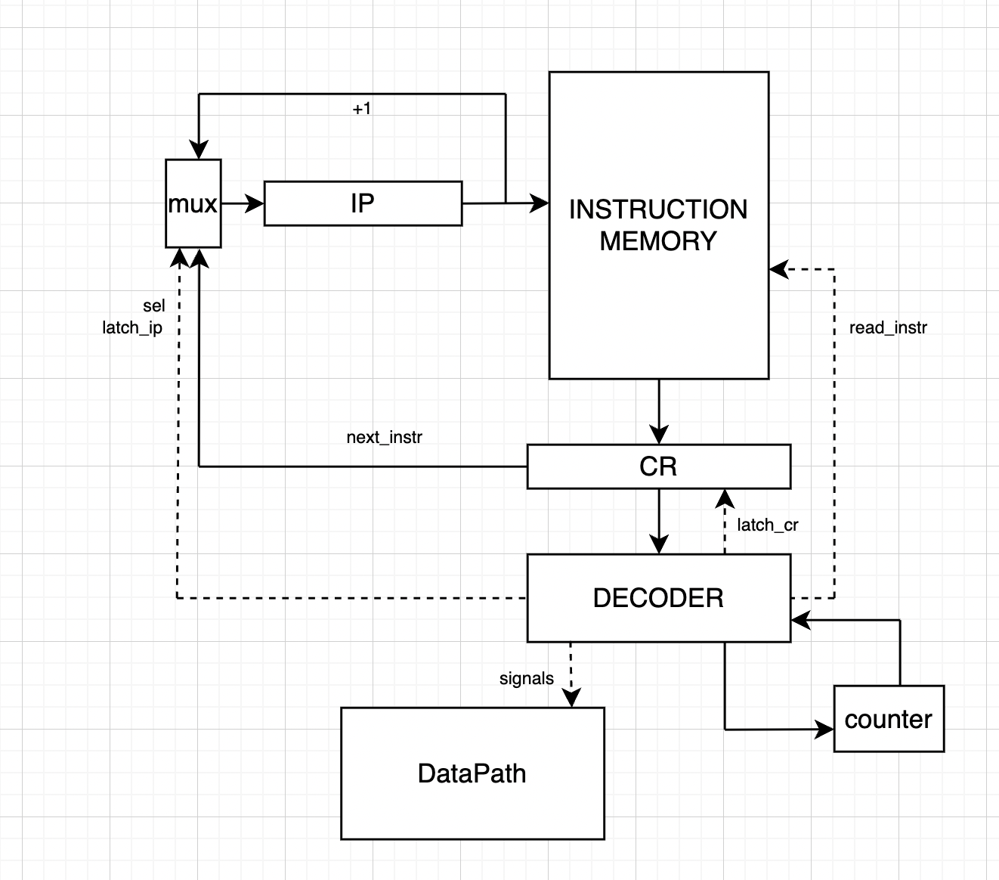

# CA-lab3

- Пронина Анастасия Ильинична, P3233
- `asm | risc | harv | hw | instr | binary -> struct | trap -> stream | port | pstr | prob1 | -`
- Базовый вариант.

## Содержание

1. [Язык программирования](#язык-программирования)
2. [Организация памяти](#организация-памяти)
3. [Система команд](#система-команд)
4. [Транслятор](#транслятор)
5. [Модель процессора](#модель-процессора)
6. [Тестирование](#тестирование)

<h2 id="язык-программирования">Язык программирования ASM</h2>

``` bnf
<program> ::= <data_section> | <text_section>

<data_section> ::= "section .data" | <data_definition> | <label>

<text_section> ::= "section .text" | <command> | <label>

<data_definition> ::= "db" {<number> | <string_literal>}+

<command> ::= "ld" <reg>, <data_address>
        |    "st" <reg>, <data_address>
        |    "mov" <reg>, <reg> | <number>
        |    "add" <reg>, <reg> | <number>, <reg> | <number>
        |    "inc" <reg>
        |    "dec" <reg>
        |    "beq" <code_address>
        |    "bne" <code_address>
        |    "jmp" <code_address>
        |    "out" <reg>, <port>
        |    "in" <reg>, <port>
        |    "hlt"
        |    "cmp" <reg> | <number>, <reg> | <number>
        |    "push" <reg>
        |    "pop" <reg>
        |    "iret"
        |    "mod" <reg>, <reg> | <number>, <reg> | <number>
        |    "div" <reg>, <reg> | <number>, <reg> | <number>
        |    "printi" <reg>

<data_address> ::= <direct_address> | <indirect_address>

<direct_address> ::= <reg> | <number> | <label>

<indirect_address> ::= [<reg>] | [<number>] | [<label>]

<code_address> ::= <number> | <label>

<label> ::= <char> {<char> | <digit>}* ":"

<string_literal> ::= "'" {<char> | <digit> | <special>}+ "'"

<number> ::= {-}* {<digit>}+

<char> ::= "a" | "b" | "c" | "d" | "e" | "f" | "g" | "h" |  "i" | "j" | "k" | "l" | "m"
           | "n" | "o" | "p" | "q" | "r" | "s" | "t" | "u" | "v" | "w" | "x" | "y" | "z"
           | "A" | "B" | "C" | "D" | "E" | "F" | "G" | "H" | "I" | "J" | "K" | "L" | "M"
           | "N" | "O" | "P" | "Q" | "R" | "S" | "T" | "U" | "V" | "W" | "X" | "Y" | "Z"

<digit> ::= "0" | "1" | "2" | "3" | "4" | "5" | "6" | "7" | "8" | "9"

<special> ::= "\n"
```

### Описание семантики ASM

- Метки определяются на отдельных строчках как для памяти команд, так и для памяти данных. Далее на эти метки можно ссылаться.
- Программа выполняется последовательно начиная с адреса, обозначенного меткой `_start`. Заканчивается на инструкции `HLT`.

#### Область видимости

Все переменные, расположенные в секции `.data`, являются глобальными, к ним можно получить доступ из любого места программы.

<h2 id="организация-памяти">Организация памяти</h2>

### Модель памяти процессора

#### Машинное слово
- **Память данных**: 32 бита.
- **Память инструкций**: 32 бита.

#### Варианты адресации для данных
- **Абсолютная адресация**: адрес ячейки может быть указан напрямую с помощью метки или числа, а также может быть загружен из указанного регистра.
- **Относительная адресация**: адрес ячейки расположен в памяти по некоторому адресу, являющемуся непосредственным аргументом команды (число, метка, регистр). 

#### Варианты адресации для команд, не работающих с памятью
- **Регистры**: в выполнении операции принимает участие значение из указанного регистра.
- **Константы**: при выполнении операции операнд загружается напрямую из регистра команд.

### Механика отображения программы и данных на процессор
```
+----------------------+
|      Registers       |
+----------------------+
| R0                   |
| R1                   |
| R2                   |
| R3                   |
+----------------------+

+-----------------------+
|   Instruction memory  |
+-----------------------+
| 00 : instruction 1    |
| ...                   |
| n  : instruction n+1  |
| ...                   |
+-----------------------+

+-----------------------+
|      Data memory      |
+-----------------------+
| 00 : num literal      |
| ...                   |
| l  : char literal     |
| l+1: char literal     |
| ...                   |
| c  : data             |
| ...                   |
+-----------------------+
```

Память данных и память инструкций разделены. 

#### Виды памяти и регистров, доступные программисту
- **Регистры общего назначения**: R1, R2, R3, R4.
- **Память данных**: в памяти данных хранятся литералы, непосредственно определенные в `section .data`

- Операции с данными выполняются так, как будто все они являются 32-разрядными целыми числами.
- Символьные литералы хранятся в одном машинном слове, занимают младшие 8 бит.
- Все переменные, определенные в `section .data`, не являются константными и могут быть изменены в процессе работы программы.
- Относительная адресация может использоваться при работе со строками или массивами, во всех остальных случаях будет использоваться абсолютная.
- Строки в памяти хранятся в следующем виде: сначала указывается длина строки, затем идет последовательность 32-разрядных слов, каждое из которых хранит один символ (pstr).
- Помимо регистров, непосредственно доступных программисту, также имеются регистр данных, регистр адреса, счетчик команд, регистр команд, а также регистр состояния.

#### Input/Output
- Взаимодействие с внешними устройствами осуществляется с помощью портов ввода/вывода. При считывании/записи значения с внешнего устройства в качестве промежуточного регистра используется регистр данных `DR`.
- Номер порта для ввода/вывода непосредственно указывается как аргумент команд `IN` и `OUT`.

#### Загрузка и сохранение в память
- Для взаимодействия с памятью есть специальные команды `LD` и `ST`, любые операции с памятью осуществляются с помощью этих команд.
- Другие команды в процессе выполнения изменять данные в памяти не могут, операции осуществляются в рамках регистров процессора.

<h2 id="система-команд">Система команд</h2>

#### Особенности процессора
- Регистры, предназначенные для работы с данными, являются 32-разрядными. Регистр адреса является 11-разрядным, счетчик команд - 7-разрядным.
- Для устройств ввода/вывода по умолчанию установлены порты соответственно 1 и 0.
- Ввод/вывод осуществляется с помощью системы прерываний: при старте модели есть расписание ввода, которое указывает, на каком шаге будет "установлен" сигнал требования прерывания. Считывание данных с внешнего устройства осуществляется в прерывании. Прерывание внутри прерывания запрещено.
- В случае возникновения запроса на прерывание значения доступных программисту регистров, а также регистра состояния и счетчика команд сохраняются в стеке до момента завершения обработки прерываний. Обработка прерывания осуществляется с помощью реализованного программистом кода.

#### Набор инструкций

#### Команда LD: arg1, arg2
- **Семантика**: загружает данные из памяти по адресу `arg2` в регистр `arg1`
- **Пример**
```
ld r0, hello        ; загрузка в r0 значения по адресу hello
ld r1, 10           ; загрузка в r1 значения по адресу 10
ld r2, r0           ; загрузка в r2 значения по адресу из r0
ld r0, [r1]         ; загрузка в r0 значения по адресу [r1]
ld r1, [hello]      ; загрузка в r1 значения по адресу [hello]
```

#### Команда ST: arg1, arg2
- **Семантика**: сохраняет данные в память по адресу `arg2` из регистра `arg1`
- **Пример**
```
st r0, hello        ; сохранение значения из регистра r0 по адресу hello
st r1, 10           ; сохранение значения из регистра r1 по адресу 10
st r2, r0           ; сохранение значения из регистра r2 по адресу из r0
st r0, [r1]         ; сохранение значения из регистра r0 по адресу из [r1]
st r1, [hello]      ; сохранение значения из регистра r1 по адресу [hello]
```

#### Команда MOV: arg1, arg2
- **Семантика**: сохраняет в регистр `arg1` значение из регистра `arg2` (если `arg2` - регистр), или загружает значение `arg2` непосредственно (если `arg2` - константа)
- **Пример**
```
mov r0, r1          ; в регистр r0 загружается значение из r1
mov r1, hello       ; в регистр r0 загружается значение метки hello
mov r2, 3           ; в регистр r0 загружается значение 3
```

#### Команда INC: arg1
- **Семантика**: инкрементирует значение регистра `arg1`
- **Пример**
```
inc r0              ; r0 <- r0 + 1
```

#### Команда DEC: arg1
- **Семантика**: декрементирует значение регистра `arg1`
- **Пример**
```
dec r0              ; r0 <- r0 - 1
```

#### Команда ADD: arg1, arg2, arg3
- **Семантика**: загружает в регистр `arg1` сумму значений `arg2` и `arg3` (или значений в соответствующих им регистрах)
- **Пример**
```
add r0, r1, r2      ; r0 <- r1 + r2
add r0, r1, 3       ; r0 <- r1 + 3
add r0, 2, 5        ; r0 <- 2 + 5
```

#### Команда DIV: arg1, arg2, arg3
- **Семантика**: загружает в регистр `arg1` результат целочисленного деления `arg2` на `arg3` (или значений в соответствующих им регистрах)
- **Пример**
```
div r0, r1, r2      ; r0 <- r1 // r2
div r0, r1, 3       ; r0 <- r1 // 3
div r0, 67, 5       ; r0 <- 67 // 5
```

#### Команда MOD: arg1, arg2, arg3
- **Семантика**: загружает в регистр `arg1` остаток от деления `arg2` на `arg3` (или значений в соответствующих им регистрах)
- **Пример**
```
mod r0, r1, r2      ; r0 <- r1 % r2
mod r0, r1, 3       ; r0 <- r1 % 3
mod r0, 7, 5        ; r0 <- 7 % 5
```

#### Команда BEQ: arg1
- **Семантика**: условный переход по адресу `arg1`, если `Z==0`
- **Пример**
```
beq loop            ; условный переход по адресу loop
```

#### Команда BNE: arg1
- **Семантика**: условный переход по адресу `arg1`, если `Z!=0`
- **Пример**
```
bne loop            ; условный переход по адресу loop
```

#### Команда JMP: arg1
- **Семантика**: условный переход по адресу `arg1`
- **Пример**
```
jmp loop            ; безусловный переход по адресу loop
```

#### Команда IN: arg1, arg2
- **Семантика**: загружает в регистр `arg1` значение с устройства ввода на порту `arg2`
- **Пример**
```
in r0, 1            ; загрузка в регистр r0 значения из порта 1
```

#### Команда OUT: arg1, arg2
- **Семантика**: загружает на устройство вывода на порту `arg2` значение из регистра `arg1`
- **Пример**
```
out r1, 0           ; загрузка в порт 0 значения из регистра r1
```

#### Команда PUSH: arg1
- **Семантика**: сохраняет на вершину стека значение из регистра `arg1`
- **Пример**
```
push r0             ; по адресу вершины стека сохраняется значение регистра r0
```

#### Команда POP: arg1
- **Семантика**: сохраняет в регистр `arg1` значение с вершины стека
- **Пример**
```
pop r1              ; в регистр r1 сохраняется значение с вершины стека
```

#### Команда CMP: arg1, arg2
- **Семантика**: устанавливает флаги состояния по результату выполнения операции `arg1` - `arg2` (или значений в соответствующих регистрах)
- **Пример**
```
cmp r0, r1          ; устанавливаются флаги по результату r0 - r1
cmp r0, 5           ; устанавливаются флаги по результату r0 - 5
cmp 5, 8            ; устанавливаются флаги по результату 5 - 8
```

#### Команда IRET
- **Семантика**: осуществляет возврат из прерывания
- **Пример**
```
iret                ; возврат из прерывания
```

#### Команда PRINTI: arg1
- **Семантика**: осуществляет вывод на стандартное устройство вывода целого числа
- **Пример**
```
printi r0           ; вывод целого числа из регистра r0 в стандартный поток вывода (port = 0)
```

#### Команда HLT
- **Семантика**: завершает выполнение программы
- **Пример**
```
hlt                 ; останов
```

#### Преобразование в бинарный код
- Инструкции делятся на два типа: работающие и не работающие с памятью
- Машинное слово инструкции - 32 бита или 4 байта
- Первые 8 бит занимает код операции (для удобства нумерацию будем вести слева направо)
- Для команды, работающей с памятью, бит 8 отвечает за тип аргумента (является он регистром или адресом), а бит 9 - за тип адресации. Оставшиеся 22 бита поровну делятся между двумя аргументами команды - первые 11 бит на первый аргумент, оставшиеся - на второй.
- Для команды, не работающей с памятью, биты 8, 9, 10 отвечают за тип аргументов 1, 2 и 3 соответственно (является аргумент регистром или числом). Оставшиеся биты делятся поровну на три возможных аргумента команды - для каждого аргумента 7 бит.

#### Примеры
```
    ld r0, 12
    00010000        ; opcode
    0               ; not register
    0               ; absolute
    00000000000     ; r0
    00000001100     ; 12
    00010000|0|0|00000000000|00000001100 -> 10 00 00 0c
```
```
    add r0, r0, r1
    00000011        ; opcode
    1               ; is register
    1               ; is register
    1               ; is register
    0000000         ; r0
    0000000         ; r0
    0000001         ; r1
    00000011|1|1|1|0000000|0000000|0000001 -> 03 E0 00 01
```

<h2 id="транслятор">Транслятор</h2>

#### Входные данные
- На вход транслятору подается текстовый файл, содержащий код программы на языке ASM.
- Также на вход подается название файла, куда нужно сохранить машинный код программы (название файла должно быть без расширения, поскольку после процесса трансляции помимо бинарного файла создается текстовый файл с мнемониками с тем же названием)

#### Выходные данные
- Транслятор возвращает бинарное представление данных и инструкций заданной программы.
- Также транслятор возвращает текстовый файл с информацией о транслируемых командах.

#### Этапы трансляции
Трансляция разделяется на три основных этапа
- **Этап 1**: на этом этапе происходит разбиение текста программы на отдельные блоки, формируется предварительное представление памяти команд и данных, при этом аргументы команд записаны в исходном виде (метки, числа, регистры). Создается словарь меток, указывающих на определенные адреса в памяти команд и данных.
- **Этап 2**: на этом этапе происходит подстановка адресов на места меток.
- **Этап 3**: на этом этапе происходит трансляция команд в бинарный код.

<h2 id="модель-процессора">Модель процессора</h2>

#### ControlUnit



#### DataPath


<h2 id="тестирование">Тестирование</h2>